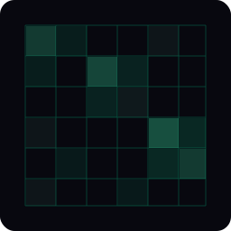

<p align="center">
  
</p>

<h1 align="center">@gridworkjs/hashgrid</h1>

<p align="center">Spatial hash grid for uniform distributions and fast neighbor lookups</p>

## Install

```
npm install @gridworkjs/hashgrid
```

## Usage

A particle simulation where thousands of uniform-sized particles need fast collision checks every frame:

```js
import { createHashGrid } from '@gridworkjs/hashgrid'
import { point, bounds } from '@gridworkjs/core'

// particles are ~10 units across, so a 20-unit cell size works well
const particles = createHashGrid(p => bounds(p.position), { cellSize: 20 })

particles.insert({ id: 'a', position: point(10, 20), vx: 1, vy: 0 })
particles.insert({ id: 'b', position: point(15, 22), vx: -1, vy: 1 })
const c = { id: 'c', position: point(300, 400), vx: 0, vy: -1 }
particles.insert(c)

// each frame, check for collisions near each particle
const nearby = particles.search({ minX: 5, minY: 15, maxX: 25, maxY: 30 })
// => [particle a, particle b]  - fast O(1) cell lookup

// find the closest neighbor for attraction/repulsion forces
particles.nearest({ x: 10, y: 20 }, 1)
// => [particle b]

// particle leaves the simulation (by reference)
particles.remove(c)
```

## When to Use a Hash Grid

Hash grids are ideal when your data is **uniformly distributed** and items are roughly the same size. They offer O(1) cell lookups, making them excellent for collision detection, particle systems, and game engines.

If your data is clustered or varies widely in size, consider `@gridworkjs/quadtree` or `@gridworkjs/rtree` instead.

## Choosing a Cell Size

The `cellSize` parameter controls the width and height of each grid cell. For best performance:

- Set `cellSize` to roughly the size of your items or the typical query range
- Too small: items span many cells, increasing memory and insert cost
- Too large: cells contain many items, reducing search selectivity

## API

### `createHashGrid(accessor, options)`

Creates a new hash grid. The `accessor` function maps each item to its bounding box (`{ minX, minY, maxX, maxY }`). Use `bounds()` from `@gridworkjs/core` to convert geometries.

The `cellSize` option is required.

Returns a spatial index implementing the gridwork protocol.

### `grid.insert(item)`

Adds an item to the grid. The item is placed into every cell its bounding box overlaps.

### `grid.remove(item)`

Removes an item by identity (`===`). Returns `true` if found and removed.

### `grid.search(query)`

Returns all items whose bounds intersect the query. Accepts bounds objects or geometry objects (point, rect, circle).

### `grid.nearest(point, k?)`

Returns the `k` nearest items to the given point, sorted by distance. Defaults to `k=1`. Accepts `{ x, y }` or a point geometry.

### `grid.clear()`

Removes all items from the grid.

### `grid.size`

Number of items in the grid.

### `grid.bounds`

Bounding box of all items, or `null` if empty.

## License

MIT
